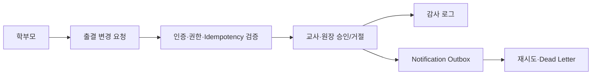

# KinderP

유치원 원장·교사·학부모가 함께 사용하는 **유치원 운영 ERP**입니다.

단순 CRUD 구현을 넘어, 여러 사용자가 하나의 유치원 데이터를 함께 처리할 때 필요한 **권한 경계, 승인 상태 전이, 동시성 제어, 감사 로그, 실패 복구**를 Spring Boot 기반으로 설계했습니다.

[](https://openjdk.org/)
[](https://spring.io/projects/spring-boot)
[](https://www.mysql.com/)
[](https://redis.io/)
[](https://github.com/answndud/kinderp/actions/workflows/ci.yml)

## 한눈에 보기

| 항목 | 내용 |
| --- | --- |
| 프로젝트 | 유치원 운영 관리 ERP |
| 역할 | 기획, 설계, 백엔드·프론트엔드 개발, 테스트, 성능 측정, 배포 준비 |
| 사용자 | 원장(`PRINCIPAL`), 교사(`TEACHER`), 학부모(`PARENT`) |
| 핵심 기술 | Java 21, Spring Boot, Spring Security, JPA, QueryDSL, MySQL, Redis |
| 화면 | Thymeleaf, HTMX, Alpine.js, Tailwind CSS |
| 실행 프로필 | `local`, `demo`, `prod` |
| 테스트 | JUnit, Testcontainers(MySQL·Redis), Playwright, k6 |

## 핵심 결과

- 알림장 목록 조회: **22 queries → 5 queries**, 17ms → 6ms
- 대시보드 통계: **13 queries → 5 queries**, 13ms → 5ms
- 대시보드 반복 조회: **5 queries → 0 queries** (60초 TTL 캐시)
- Outbox dead-letter 조회: `Using filesort` → `Backward index scan`
- Backend CI: **5분 28초 → 1분대**로 빠른 검증 workflow 분리
- k6 부하 테스트: 주요 조회 API error rate **0%**

> 수치는 로컬 Docker 환경에서 동일 시나리오를 비교한 결과입니다. 측정 조건과 한계는 [성능 측정 방법론](./docs/architecture/performance-methodology.md)에 정리했습니다.

## 대표 업무 흐름

학부모가 출결 변경을 요청하면 시스템은 로그인 세션과 유치원 소속을 확인한 뒤 요청을 저장합니다. 네트워크 재전송은 `Idempotency-Key`로 중복 처리하고, 교사 또는 원장이 승인·거절하면 허용된 상태 전이와 동시성 조건을 검증합니다.

처리 결과는 업무 감사 로그와 알림 Outbox에 남습니다. 외부 알림 전달이 실패하면 재시도와 dead-letter 전환을 수행하며, 원장은 운영 화면에서 실패 원인과 재처리 이력을 확인할 수 있습니다.



## 주요 기능

| 사용자 | 주요 업무 |
| --- | --- |
| 원장 | 교사·학부모 신청 승인, 반·원생 관리, 대시보드, 활성 세션 제어, 감사 로그·CSV export, Outbox 재처리 |
| 교사 | 일별 출결, 출결 변경 요청 승인, 알림장·공지·일정 관리 |
| 학부모 | 원생 입학 신청, 출결 변경 요청, 알림장·출석 상태 확인 |

공통으로 Google/Kakao OAuth2, HTTP-only cookie 기반 JWT, Redis refresh session, 알림·감사 이벤트를 제공합니다.

## 기술 스택 및 구조

- **Backend:** Java 21, Spring Boot 3.5.14, Spring MVC, Spring Security
- **Persistence:** Spring Data JPA, QueryDSL, MySQL 8, Flyway
- **Session/Cache:** Redis, JWT HTTP-only cookie, refresh token rotation
- **Frontend:** Thymeleaf SSR, HTMX, Alpine.js, Tailwind CSS
- **Observability:** Actuator, Prometheus, Grafana, correlation ID, structured logging
- **Delivery:** Docker Compose, GitHub Actions, production-like 배포·백업·복구 runbook

```text
src/main/java/com/kinderp/
├── domain/       # auth, member, kid, attendance, application, notification ...
└── global/       # security, config, exception, common

src/main/resources/
├── templates/    # 역할 기반 SSR 화면
└── db/migration/ # Flyway migration
```

Spring Boot 모놀리식 구조 안에서 도메인별 책임을 분리했습니다. OSIV는 `OFF`로 유지하고, URL 권한과 메서드 권한을 함께 검사합니다. 운영 환경에서는 Swagger, demo seed, app-port Prometheus를 기본 비활성화합니다.

## 화면

| 원장 대시보드 | 출석 관리 |
| --- | --- |
|  |  |

| 신청 처리 큐 | 알림장 |
| --- | --- |
|  |  |

| 인증 감사 로그 | 업무 감사 로그 |
| --- | --- |
|  |  |

| 알림 Outbox 운영 |
| --- |
|  |

## 로컬 실행

### 1. 인프라 실행

```bash
git clone https://github.com/answndud/kinderp.git
cd kinderp

cp docker/.env.example docker/.env
docker compose --env-file docker/.env -f docker/docker-compose.yml up -d
```

### 2. Demo 프로파일 실행

```bash
SPRING_PROFILES_ACTIVE=demo ./gradlew bootRun
```

| 역할 | 계정 |
| --- | --- |
| 원장 | `principal@test.com / test1234!` |
| 교사 | `teacher1@test.com / test1234!` |
| 학부모 | `parent1@test.com / test1234!` |

주요 화면은 `http://localhost:8080/dashboard`에서 시작할 수 있습니다. Swagger UI는 `http://localhost:8080/swagger-ui.html`입니다.

### 3. 검증

```bash
# 빠른 검증
./gradlew fastTest bootJar

# 전체 검증
./gradlew test

# 프론트엔드·브라우저 검증
npm run frontend:build
npm run accessibility:templates
npm run e2e:smoke
```

통합 테스트는 MySQL·Redis Testcontainers를 사용합니다. 실행 환경별 필수 변수는 [환경 변수 계약](./docs/guides/env-contract.md)을 참고하세요.

## 더 보기

| 문서 | 내용 |
| --- | --- |
| [설계 서사](./docs/architecture/portfolio-story.md) | 대표 업무 흐름, 권한·상태 전이, Outbox 설계 |
| [성능 측정 방법론](./docs/architecture/performance-methodology.md) | 측정 조건, 전후 비교, 한계 |
| [개발자 가이드](./docs/guides/developer-guide.md) | 구조, 실행, 코드 규칙 |
| [배포 가이드](./docs/guides/deployment-guide.md) | Docker, 환경 변수, 백업·복구 |
| [문서 인덱스](./docs/README.md) | 전체 문서 목록 |

## 라이선스

MIT License
