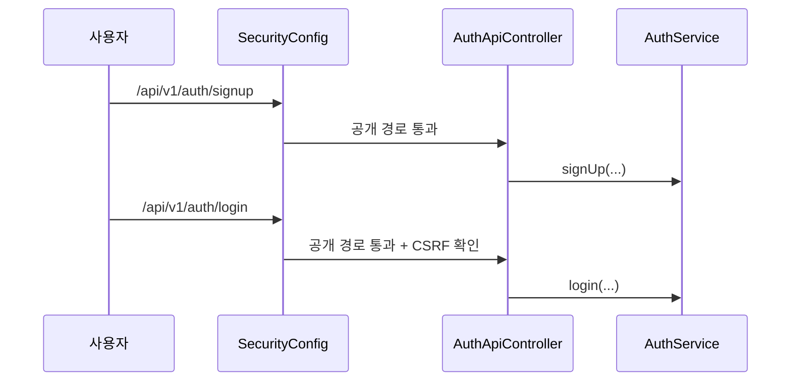

# [Spring Boot 포트폴리오] 11. `SecurityConfig`와 회원가입/로그인 기본 흐름을 어떻게 붙였는가

## 1. 이번 글에서 풀 문제

도메인이 어느 정도 만들어졌다면 이제 “누가 이 기능을 쓸 수 있는가”를 정해야 합니다.

KinderP에서 인증의 첫 단계는 아래 문제를 푸는 것이었습니다.

- 비로그인 사용자는 어디까지 접근 가능한가?
- 회원가입과 로그인은 어떤 API로 시작되는가?
- 원장, 교사, 학부모는 기본적으로 어떻게 구분되는가?
- JWT를 쓰더라도 CSRF는 어떻게 다뤄야 하는가?

이번 글은 고급 JWT rotation이나 세션 레지스트리 전 단계입니다.
즉, **Spring Security를 프로젝트에 처음 연결하는 기본 흐름**을 다룹니다.

## 2. 먼저 알아둘 개념

### 2-1. Security Filter Chain

Spring Security는 요청이 컨트롤러에 도착하기 전에 여러 필터를 거쳐 인증/인가를 처리합니다.

이 필터들의 묶음을 `SecurityFilterChain`이라고 생각하면 됩니다.

### 2-2. 공개 경로와 인증 필요 경로

모든 URL이 같은 규칙을 가지면 안 됩니다.

- `/login`, `/signup`
- `/api/v1/auth/login`
- `/api/v1/auth/signup`

같은 경로는 공개여야 하고,

- 출결
- 알림장
- 공지
- 프로필/설정

같은 경로는 인증이 필요합니다.

### 2-3. 쿠키 기반 JWT와 CSRF

이 프로젝트는 JWT를 헤더가 아니라 **HTTP-only 쿠키**에 담습니다.

이 경우 브라우저가 자동으로 쿠키를 보내므로,
CSRF를 다시 켜는 편이 안전합니다.

### 2-4. 요청별 기대 결과를 먼저 고정하자

초보자가 가장 헷갈리는 지점은 “어떤 요청이 열려 있어야 하고, 어떤 요청이 막혀 있어야 하는가”입니다.

그래서 글을 읽기 전에 아래 표를 먼저 머리에 넣는 편이 좋습니다.

| 요청 | 로그인 여부 | 기대 결과 | 이유 |
|---|---|---|---|
| `/login`, `/signup` | 비로그인 | 열려 있어야 함 | 첫 진입 화면이기 때문 |
| `/api/v1/auth/signup`, `/api/v1/auth/login` | 비로그인 | 열려 있어야 함 | 계정 생성과 로그인 진입점이기 때문 |
| `/dashboard`, `/attendance`, `/settings` | 비로그인 | 막혀야 함 | 업무 화면은 인증 뒤에만 보여야 하기 때문 |
| 보호된 API | 로그인 | 역할과 권한에 따라 통과/거절 | 인증만으로 끝나지 않고 역할까지 봐야 하기 때문 |

## 3. 이번 글에서 다룰 파일

```text
- src/main/java/com/erp/global/config/SecurityConfig.java
- src/main/java/com/erp/global/config/CsrfCookieFilter.java
- src/main/java/com/erp/domain/auth/controller/AuthApiController.java
- src/main/java/com/erp/domain/auth/service/AuthService.java
- src/main/java/com/erp/domain/member/service/MemberService.java
- src/test/java/com/erp/api/AuthApiIntegrationTest.java
- src/test/java/com/erp/integration/PageAccessIntegrationTest.java
- docs/COMPLETED.md#archive-002
```

## 4. 설계 구상

이 단계의 목표는 “인증 가능한 기본 서비스”를 만드는 것이었습니다.

핵심 설계 기준은 아래였습니다.

1. 인증되지 않은 사용자가 들어올 공개 경로를 명확히 둔다
2. 로그인/회원가입 API는 `AuthApiController`로 모은다
3. 비밀번호 검사는 `AuthService`가 맡는다
4. JWT 쿠키를 쓰더라도 CSRF는 켠다

## 5. 코드 설명

### 5-1. `SecurityConfig`: 보안 규칙의 시작점

[SecurityConfig.java](../src/main/java/com/erp/global/config/SecurityConfig.java)의 핵심 메서드는 아래입니다.

- `securityFilterChain(...)`
- `corsConfigurationSource()`
- `jwtFilter()`
- `buildPublicEndpoints()`

이 메서드들로 아래를 결정합니다.

- 어떤 경로가 공개인가
- 어떤 경로가 인증이 필요한가
- JWT 필터를 어느 위치에 둘 것인가
- logout, oauth2 login, csrf 정책을 어떻게 둘 것인가

### 5-2. `securityFilterChain(...)`: 기본 보안 정책을 조합한다

이 메서드에서 중요한 설정은 아래입니다.

- `csrf(...)`
  - `CookieCsrfTokenRepository.withHttpOnlyFalse()`
- `formLogin().disable()`
- `httpBasic().disable()`
- `sessionCreationPolicy(SessionCreationPolicy.IF_REQUIRED)`
- `authorizeHttpRequests(...)`
- `logout(...)`
- `oauth2Login(...)`
- `addFilterBefore(jwtFilter(), UsernamePasswordAuthenticationFilter.class)`

즉, 이 프로젝트는

- 기본 폼 로그인 대신 자체 로그인 API를 쓰고
- JWT 필터를 직접 추가하고
- OAuth2 handshake 때문에 세션은 최소한으로만 허용합니다.

### 5-3. `buildPublicEndpoints()`: 공개 경로를 한 곳에서 관리한다

이 메서드는 아래 공개 경로를 모읍니다.

- `/`
- `/login`
- `/signup`
- `/api/v1/auth/signup`
- `/api/v1/auth/login`
- `/api/v1/auth/refresh`
- `/actuator/health`

그리고 설정값에 따라 local/demo에서만 Swagger/OpenAPI, Prometheus 경로를 명시적으로 열 수 있습니다.
또 현재 저장소는 `StartupSafetyValidator`로 런타임 프로파일과 공개 management surface 기본값까지 함께 확인합니다.

이렇게 리스트를 한 곳에서 만들면

- 보안 정책이 흩어지지 않고
- profile별 노출 차이를 연결하기 쉽습니다.

### 5-4. `CsrfCookieFilter`: 쿠키 기반 인증에서 CSRF 토큰을 초기에 발급한다

[CsrfCookieFilter.java](../src/main/java/com/erp/global/config/CsrfCookieFilter.java)는 매우 짧지만 중요합니다.

핵심 메서드는 아래입니다.

- `doFilterInternal(...)`

이 필터는 초기 요청에도 CSRF 토큰이 쿠키로 발급되게 도와줍니다.

즉, 로그인/회원가입 같은 첫 요청에서도 클라이언트가 CSRF 토큰을 받을 수 있게 합니다.

### 5-5. `AuthApiController`: 인증 API 진입점

[AuthApiController.java](../src/main/java/com/erp/domain/auth/controller/AuthApiController.java)의 핵심 메서드는 아래입니다.

- `signUp(...)`
- `login(...)`
- `logout(...)`
- `refresh(...)`
- `getCurrentMember(...)`

이 시점에서 중요한 것은 “API 경계를 한 컨트롤러에 모은다”는 점입니다.

### 5-6. `AuthService`: 컨트롤러보다 아래에서 인증 흐름을 조율한다

[AuthService.java](../src/main/java/com/erp/domain/auth/service/AuthService.java)의 초반 핵심 메서드는 아래입니다.

- `signUp(...)`
- `login(...)`
- `logout(...)`

즉, 컨트롤러는 HTTP 요청/응답만 처리하고,
실제 인증 흐름 조율은 서비스가 맡습니다.

## 6. 실제 흐름



즉, 로그인/회원가입은 공개 경로지만
그 외 업무 화면과 API는 보안 체인을 통과해야 합니다.

## 7. 테스트로 검증하기

관련 테스트는 아래가 핵심입니다.

- `AuthApiIntegrationTest`
  - 회원가입 성공/실패
  - 로그인 성공/실패
  - 공통 에러 응답 형식
- `PageAccessIntegrationTest`
  - 비로그인 접근
  - 원장/교사/학부모별 페이지 접근

즉, 보안 설정을 코드만 믿지 않고 실제 HTTP 요청으로 검증합니다.

> 현재 구현의 한계
> 이 글은 인증을 프로젝트에 처음 연결하는 단계까지만 다룹니다.
> 여기까지만으로는 “같은 유치원 안에서 누가 무엇을 볼 수 있는가” 같은 세밀한 멀티테넌시 권한 문제까지 닫히지 않습니다.
> 그 문제는 이후 [13-multitenant-access-hardening.md](./13-multitenant-access-hardening.md)에서 따로 다룹니다.

## 8. 회고

이 단계에서 중요한 교훈은 아래입니다.

1. 보안 설정은 나중에 붙이는 옵션이 아니다
2. JWT를 쓴다고 CSRF를 무조건 꺼서는 안 된다
3. 로그인 API를 만들 때는 컨트롤러와 서비스 책임을 일찍 나눠야 한다

이 기본 구조가 있었기 때문에 나중에

- JWT rotation
- 활성 세션 관리
- rate limit
- OAuth2 lifecycle

같은 고도화가 자연스럽게 이어졌습니다.

## 9. 취업 포인트

면접에서는 이렇게 설명하면 좋습니다.

- “Spring Security 기본 흐름은 `SecurityConfig`에서 공개 경로와 인증 경로를 먼저 나누는 것부터 시작했습니다.”
- “JWT를 쿠키에 담기 때문에 CSRF를 켜는 쪽이 안전하다고 판단했습니다.”
- “컨트롤러는 HTTP 경계, 서비스는 인증 흐름 조율을 맡도록 책임을 나눴습니다.”

### 9-1. 1문장 답변

- “인증 기능을 붙일 때 가장 먼저 공개 경로와 보호 경로를 나누고, 쿠키 기반 JWT에 맞춰 CSRF까지 같이 설계했습니다.”

### 9-2. 30초 답변

- “이 단계에서는 Spring Security를 프로젝트에 처음 연결하는 것이 목표였습니다. `SecurityConfig`에서 공개 경로와 보호 경로를 먼저 정리하고, JWT를 HTTP-only 쿠키에 담기 때문에 CSRF를 켜 두었습니다. 그리고 로그인/회원가입 API는 `AuthApiController`, 실제 검증 흐름은 `AuthService`로 나눠 이후 JWT 고도화가 가능하게 만들었습니다.”

### 9-3. 예상 꼬리 질문

- “JWT를 쓰는데 왜 CSRF를 켰나요?”
- “폼 로그인 대신 직접 로그인 API를 만든 이유는 무엇인가요?”
- “이 단계의 보안 설정만으로 충분하지 않았던 이유는 무엇인가요?”

## 10. 시작 상태

- `02`~`10`까지 따라와서 Spring Boot 뼈대, 실행 환경, 공통 설정, 기본 도메인 구조가 준비돼 있어야 합니다.
- 최소한 `Member` 도메인과 공통 예외 응답 구조가 있어야 회원가입/로그인 API를 올릴 수 있습니다.
- 이 글의 목표는 **인증 기능의 첫 진입점**을 만드는 것입니다.

## 11. 이번 글에서 바뀌는 파일

```text
- 핵심 설정 / 필터:
  - src/main/java/com/erp/global/config/SecurityConfig.java
  - src/main/java/com/erp/global/config/CsrfCookieFilter.java
  - src/main/java/com/erp/global/config/StartupSafetyValidator.java
  - src/main/resources/application.yml
- 인증 API / 서비스:
  - src/main/java/com/erp/domain/auth/controller/AuthApiController.java
  - src/main/java/com/erp/domain/auth/service/AuthService.java
  - src/main/java/com/erp/domain/auth/dto/request/LoginRequest.java
- 검증 파일:
  - src/test/java/com/erp/api/AuthApiIntegrationTest.java
  - src/test/java/com/erp/integration/PageAccessIntegrationTest.java
```

## 12. 구현 체크리스트

1. `SecurityConfig`에서 공개 경로와 인증 필요 경로를 나눕니다.
2. `CsrfCookieFilter`를 추가해 초기 요청에서도 CSRF 쿠키가 발급되게 합니다.
3. `AuthApiController`에 회원가입 / 로그인 / 로그아웃 / refresh API 진입점을 둡니다.
4. `AuthService`에서 회원 생성과 로그인 검증 흐름을 분리합니다.
5. 기본값은 닫힌 상태로 두고, 프로파일과 management surface 공개 설정을 명시적으로 열도록 정리합니다.
6. 통합 테스트로 공개 경로, 인증 실패, 페이지 접근 제어를 검증합니다.

## 13. 실행 / 검증 명령

```bash
./gradlew compileJava compileTestJava
./gradlew --no-daemon integrationTest
./gradlew bootRun --args='--spring.profiles.active=local'
```

기본값은 닫혀 있으므로 `SPRING_PROFILES_ACTIVE`를 명시하지 않으면 앱이 부팅되지 않습니다.

빠르게 확인하고 싶다면 아래처럼 관련 테스트만 좁혀 볼 수도 있습니다.

```bash
./gradlew --no-daemon integrationTest \
  --tests "com.kinderp.api.AuthApiIntegrationTest" \
  --tests "com.kinderp.integration.PageAccessIntegrationTest"
```

다만 일부 환경에서는 좁힌 `--tests` 실행 시 Gradle XML result writer 충돌이 날 수 있으므로, 블로그의 기본 검증 경로는 전체 `integrationTest`로 둡니다.

성공하면 확인할 것:

- `/api/v1/auth/signup`, `/api/v1/auth/login`이 공개 경로로 동작한다
- 비로그인 상태에서 보호된 페이지 접근 시 로그인 경로로 유도된다
- 회원가입/로그인 실패 시 공통 에러 포맷이 유지된다

## 14. 산출물 체크리스트

- `SecurityConfig`에 공개 경로와 인증 필요 경로가 분리돼 있다
- `CsrfCookieFilter`가 보안 필터 체인 뒤에서 CSRF 쿠키를 내려준다
- `AuthApiController`에 회원가입 / 로그인 / 로그아웃 / refresh 진입점이 있다
- `AuthService`가 회원 생성과 로그인 검증을 담당한다
- `StartupSafetyValidator`가 프로파일 미지정이나 공개 기본값 실수를 부팅 단계에서 막는다
- `AuthApiIntegrationTest`, `PageAccessIntegrationTest`가 보안 진입점을 검증한다

## 15. 글 종료 체크포인트

- 공개 경로와 인증 필요 경로가 `SecurityConfig`에 정리돼 있다
- 인증 API가 `AuthApiController`와 `AuthService`로 분리돼 있다
- 쿠키 기반 인증을 위한 CSRF 초기화 흐름이 존재한다
- 보안 설정을 통합 테스트로 검증할 수 있다

## 16. 자주 막히는 지점

- 증상: 로그인 API가 403으로 막힘
  - 원인: CSRF 토큰 흐름을 고려하지 않았거나 공개 경로 설정이 빠졌을 수 있습니다
  - 확인할 것: `SecurityConfig.buildPublicEndpoints()`와 `CsrfCookieFilter` 등록 여부

- 증상: 비로그인 접근이 기대와 다르게 동작함
  - 원인: SecurityConfig와 뷰 인터셉터/페이지 접근 규칙이 어긋났을 수 있습니다
  - 확인할 것: `PageAccessIntegrationTest` 결과와 보호 페이지 URL 매핑
