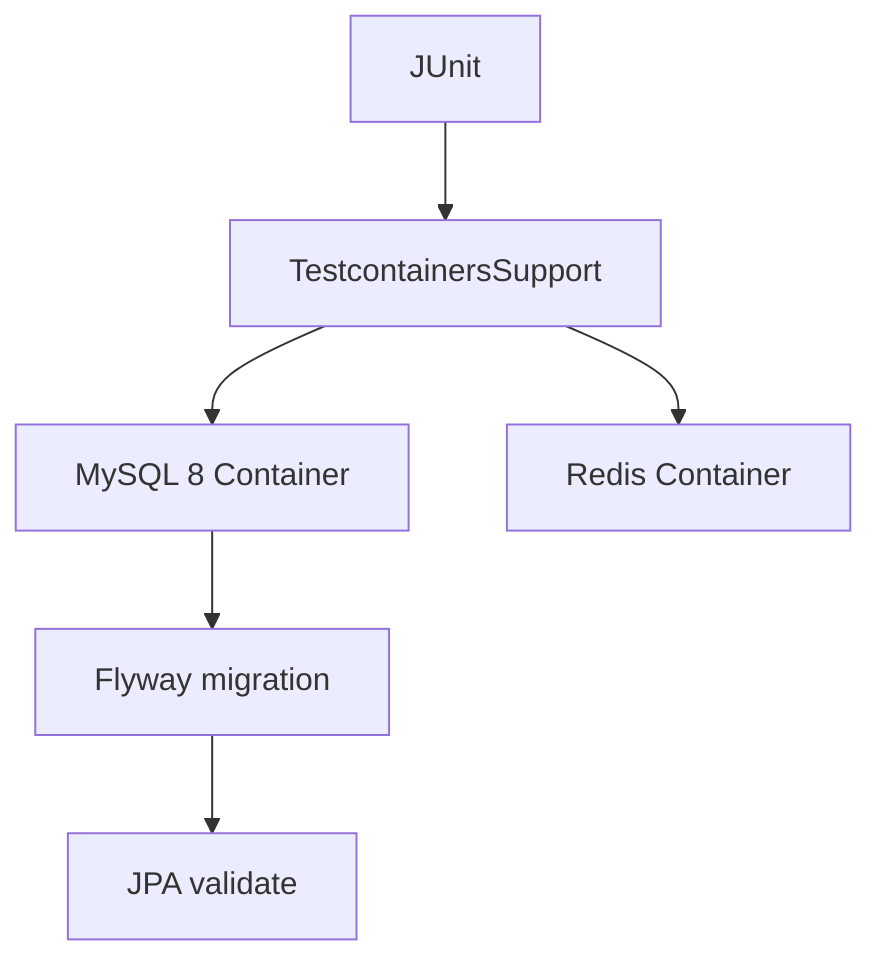
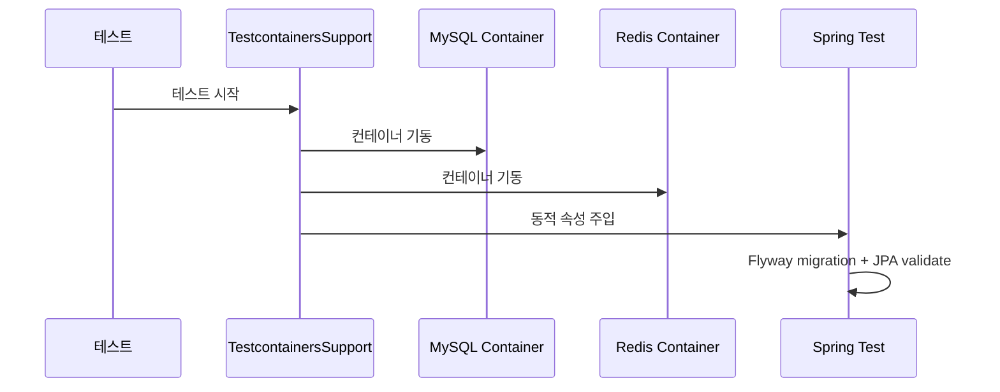

# [Spring Boot 포트폴리오] 14. 왜 H2가 아니라 Testcontainers를 붙였는가

## 1. 이번 글에서 풀 문제

테스트를 처음 붙일 때 많은 프로젝트가 이렇게 시작합니다.

- H2 메모리 DB
- `ddl-auto=create-drop`
- Redis는 mock

빠르고 편합니다. 하지만 이 프로젝트는 어느 순간 이 방식이 부족해졌습니다.

- 실제 운영 DB는 MySQL인데 테스트는 H2였다
- 실제 스키마는 Flyway가 관리하는데 테스트는 JPA가 만들었다
- 실제 인증은 Redis에 의존하는데 테스트는 mock이었다

즉, 테스트가 통과해도 운영에서 깨질 수 있는 구조였습니다.

## 2. 먼저 알아둘 개념

### 2-1. Testcontainers

Testcontainers는 테스트 실행 중 Docker 컨테이너를 띄워
실제 인프라에 가까운 환경에서 검증하게 해 주는 도구입니다.

### 2-2. 운영과 닮은 테스트

포트폴리오에서 중요한 것은 테스트 개수보다
“얼마나 믿을 수 있는 환경에서 검증했는가”입니다.

### 2-3. `Flyway + validate`

테스트에서도

- Flyway가 실제 스키마를 만들고
- JPA는 validate만 하는 구조

를 유지하면 엔티티-스키마 drift를 더 잘 잡을 수 있습니다.

### 2-4. 무엇이 H2와 달라지는지 먼저 비교하자

초보자는 “H2보다 실제 DB가 더 좋다” 정도로만 이해하기 쉽습니다.
하지만 바뀌는 지점을 표로 보면 훨씬 명확합니다.

| 항목 | H2/Mock 기반 | Testcontainers 기반 |
|---|---|---|
| DB 종류 | H2 | MySQL 8 |
| Redis | mock 가능 | 실제 Redis |
| 스키마 생성 | JPA `create-drop`에 기대기 쉬움 | Flyway migration + JPA validate |
| 장점 | 빠르고 간단함 | 운영과 더 비슷함 |
| 단점 | 운영과 차이가 큼 | 느리고 Docker가 필요함 |

## 3. 이번 글에서 다룰 파일

```text
- build.gradle
- src/test/resources/application-test.yml
- src/test/java/com/kinderp/common/TestcontainersSupport.java
- src/test/java/com/kinderp/common/BaseIntegrationTest.java
- src/test/java/com/kinderp/KinderpApplicationTests.java
- docs/COMPLETED.md#archive-002
```

## 4. 설계 구상

이 단계의 기준은 단순했습니다.

1. 테스트 DB도 MySQL이어야 한다
2. 테스트 Redis도 실제 Redis여야 한다
3. 테스트 스키마도 Flyway가 만들어야 한다



## 5. 코드 설명

### 5-1. `build.gradle`: Testcontainers 의존성 추가

핵심 추가 의존성은 아래입니다.

- `org.testcontainers:testcontainers`
- `org.testcontainers:junit-jupiter`
- `org.testcontainers:mysql`

즉, 테스트 인프라를 코드로 올린 것입니다.

### 5-2. `application-test.yml`: 테스트도 validate를 유지한다

[application-test.yml](../src/test/resources/application-test.yml)의 핵심은 아래입니다.

- `spring.jpa.hibernate.ddl-auto=validate`
- `spring.flyway.enabled=true`

즉, 테스트에서도 JPA가 스키마를 만들지 않습니다.

### 5-3. `TestcontainersSupport`: 동적 인프라 주입의 중심

[TestcontainersSupport.java](../src/test/java/com/kinderp/common/TestcontainersSupport.java)의 핵심은 아래입니다.

- `MYSQL`
- `REDIS`
- `registerContainerProperties(...)`

이 메서드가

- datasource
- flyway
- redis

속성을 컨테이너 값으로 주입합니다.

### 5-4. `BaseIntegrationTest`: 통합 테스트 공통 기반

[BaseIntegrationTest.java](../src/test/java/com/kinderp/common/BaseIntegrationTest.java)는

- 컨테이너 인프라 상속
- 테스트 데이터 초기화
- Redis flush
- 인증 헬퍼

를 공통으로 제공합니다.

즉, 개별 기능 테스트들이 모두 같은 현실적인 기반 위에서 돕니다.

## 6. 실제 흐름



## 7. 테스트로 검증하기

핵심 검증 파일은 아래입니다.

- `KinderpApplicationTests`
  - 컨텍스트 로드
- `BaseIntegrationTest`
  - 모든 API 통합 테스트의 기반

그리고 결정 로그인 [phase15_testcontainers_integration_test_stack.md](../docs/COMPLETED.md#archive-002)에
왜 H2를 버리고 이 구조로 갔는지 정리돼 있습니다.

## 8. 회고

Testcontainers는 H2보다 느립니다.
하지만 이 프로젝트에서는 그 비용을 감수할 가치가 있었습니다.

이유는 단순합니다.

- 인증/세션이 Redis에 의존하고
- 스키마가 Flyway에 의존하고
- 운영 DB가 MySQL이기 때문입니다

즉, 현실과 다른 테스트는 빨라도 설득력이 약했습니다.

### 현재 구현의 한계

Testcontainers는 신뢰도를 크게 올리지만 **속도 비용과 Docker 의존성**이 있습니다.
그래서 모든 테스트를 무조건 integration으로 몰아넣는 것이 아니라, 뒤 글에서 `fast / integration / performance`로 다시 나눠 실행 전략을 분리합니다.

## 9. 취업 포인트

- “H2 대신 MySQL/Redis Testcontainers로 테스트를 현실화했습니다.”
- “테스트에서도 `Flyway + validate`를 유지해 엔티티와 스키마 drift를 검증했습니다.”
- “테스트 개수보다 운영과 닮은 검증 환경이 더 중요하다고 판단했습니다.”

### 9-1. 1문장 답변

- “H2와 mock Redis 대신 MySQL/Redis Testcontainers를 도입해, 운영과 닮은 테스트 환경에서 `Flyway + validate`를 실제로 검증했습니다.”

### 9-2. 30초 답변

- “이 프로젝트는 MySQL, Redis, Flyway에 실제로 의존하기 때문에 H2 기반 통합 테스트로는 신뢰도가 부족했습니다. 그래서 `TestcontainersSupport`로 MySQL과 Redis를 띄우고, `application-test.yml`에서도 JPA가 스키마를 만드는 대신 Flyway migration 후 validate만 하도록 바꿨습니다. 느려지긴 했지만, 운영 스택과 훨씬 비슷한 환경에서 깨지는 지점을 잡을 수 있게 됐습니다.”

### 9-3. 예상 꼬리 질문

- “왜 H2로는 부족했나요?”
- “Testcontainers 도입 후 느려진 테스트는 어떻게 관리했나요?”
- “왜 테스트에서도 `Flyway + validate`를 유지했나요?”

## 10. 시작 상태

- `02`~`05`까지 따라와서 JPA, Flyway, Redis 설정이 들어간 상태여야 합니다.
- 기본 통합 테스트 구조가 있지만 아직 H2/Mock 기반이거나 현실성이 약한 상태를 가정합니다.
- 이 글의 목표는 **테스트 인프라를 실제 MySQL/Redis에 가깝게 바꾸는 것**입니다.

## 11. 이번 글에서 바뀌는 파일

```text
- 의존성 / 테스트 설정:
  - build.gradle
  - src/test/resources/application-test.yml
- 컨테이너 / 테스트 기반:
  - src/test/java/com/kinderp/common/TestcontainersSupport.java
  - src/test/java/com/kinderp/common/BaseIntegrationTest.java
  - src/test/java/com/kinderp/KinderpApplicationTests.java
- 결정 로그:
  - docs/COMPLETED.md#archive-002
```

## 12. 구현 체크리스트

1. `build.gradle`에 Testcontainers 의존성을 추가합니다.
2. `application-test.yml`에서 `Flyway + validate` 전략을 유지합니다.
3. `TestcontainersSupport`로 MySQL/Redis 컨테이너를 공통으로 띄웁니다.
4. `BaseIntegrationTest`가 이 컨테이너 기반을 상속하도록 정리합니다.
5. 실제 컨텍스트 로드와 대표 통합 테스트로 회귀를 확인합니다.

## 13. 실행 / 검증 명령

```bash
./gradlew compileJava compileTestJava
./gradlew --no-daemon integrationTest
```

빠르게 관련 테스트만 보고 싶다면 아래 명령을 추가로 사용할 수 있습니다.

```bash
./gradlew test --tests "com.kinderp.KinderpApplicationTests"
./gradlew test --tests "com.kinderp.api.AuthApiIntegrationTest"
```

성공하면 확인할 것:

- 테스트 시작 시 MySQL/Redis 컨테이너가 올라온다
- Flyway migration 후 JPA validate가 통과한다
- 대표 통합 테스트가 H2가 아닌 실제 컨테이너 기반으로 돈다

여기서 한 단계 더 생각하면 좋습니다.

- `integrationTest`
  - MySQL/Redis 같은 실제 의존성을 검증
- `package-smoke`
  - 실행 가능한 bootJar와 compose config를 검증

즉 Testcontainers는 “운영과 닮은 테스트”의 핵심 축이고,
배포 단위 검증은 이후 CI 글에서 별도 축으로 분리합니다.

## 14. 산출물 체크리스트

- `build.gradle`에 Testcontainers 관련 의존성이 존재한다
- `application-test.yml`이 `Flyway + validate`를 사용한다
- `TestcontainersSupport`, `BaseIntegrationTest`가 공통 기반으로 연결돼 있다
- `KinderpApplicationTests`와 대표 integration 테스트가 컨테이너 기반으로 실행된다

## 15. 글 종료 체크포인트

- 테스트 DB와 Redis가 컨테이너 기반으로 올라온다
- 테스트도 `Flyway + validate`를 유지한다
- `BaseIntegrationTest`가 현실적인 공통 기반이 된다
- “운영 스택과 닮은 테스트 환경”을 설명할 수 있다

## 16. 자주 막히는 지점

- 증상: 로컬에서는 테스트가 뜨지 않음
  - 원인: Docker daemon이 꺼져 있거나 Testcontainers가 컨테이너를 띄우지 못했을 수 있습니다
  - 확인할 것: `docker ps`, Docker Desktop 실행 상태

- 증상: 테스트에서 스키마 오류가 남
  - 원인: Flyway migration과 엔티티 매핑이 어긋났는데 H2 시절에는 가려졌을 수 있습니다
  - 확인할 것: `application-test.yml`의 `validate` 유지 여부와 migration 누락 여부
