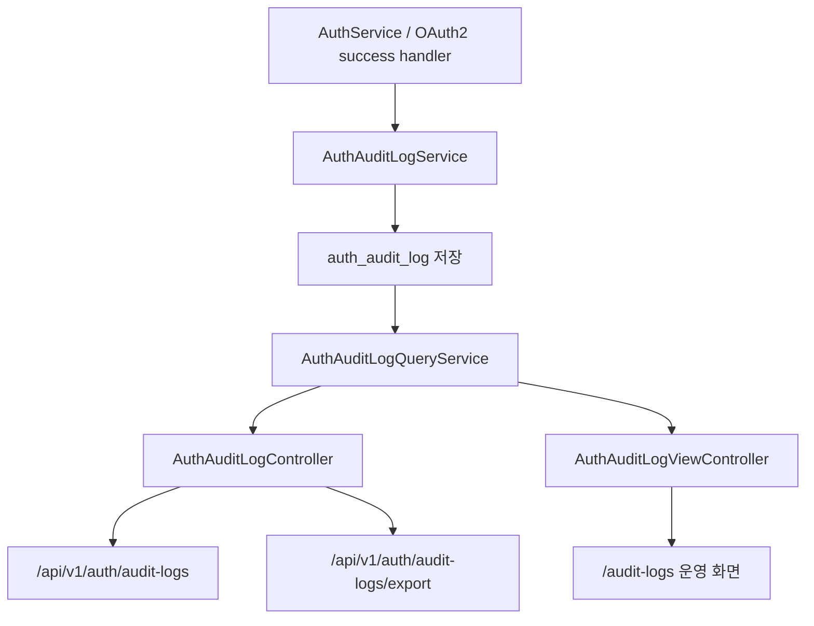
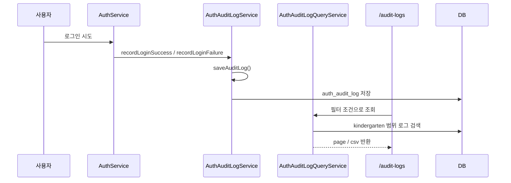

# [Spring Boot 포트폴리오] 19. 인증 감사 로그와 원장용 운영 콘솔 만들기

## 1. 이번 글에서 풀 문제

로그인 기능을 만든 뒤 많은 초보 프로젝트는 여기서 멈춥니다.

- 로그인 성공
- 로그인 실패
- refresh 성공

하지만 운영 관점에서는 이 정도로는 부족합니다.

- 누가 언제 로그인에 실패했는가?
- 어떤 이메일에서 반복 실패가 발생했는가?
- 원장이 자기 유치원 범위의 인증 이력을 직접 볼 수 있는가?
- 나중에 CSV로 내려 받아 분석할 수 있는가?

KinderP는 이 문제를 `auth_audit_log`라는 별도 도메인으로 풀었습니다.
중요한 점은 단순히 DB에 저장하는 데서 끝나지 않고,

- 저장
- 원장 범위 조회
- CSV export
- 운영 화면

까지 한 흐름으로 닫았다는 점입니다.

## 2. 먼저 알아둘 개념

### 2-1. 인증 로깅과 일반 애플리케이션 로그는 다르다

애플리케이션 로그는 디버깅용입니다.
반면 인증 감사 로그는 **운영 증적**입니다.

그래서 아래 속성이 필요합니다.

- 누가 수행했는가
- 어떤 이벤트였는가
- 성공/실패 여부
- 이유 코드
- client IP
- 언제 발생했는가

### 2-2. 감사 로그는 본 업무 트랜잭션과 분리하는 편이 좋다

로그인을 처리하는 중 감사 로그 저장이 잠깐 실패했다고 해서
로그인 자체가 모두 실패하면 안 됩니다.

그래서 이 프로젝트는 감사 로그 저장을 `REQUIRES_NEW` 트랜잭션으로 분리합니다.

### 2-3. “저장”과 “조회 도구”는 다른 문제다

감사 로그를 저장하는 것만으로는 운영자가 쓰기 어렵습니다.
실제 운영에서는 아래 기능이 필요합니다.

- 기간 필터
- 이벤트 필터
- 이메일 검색
- 페이지네이션
- CSV export

### 2-4. 어떤 인증 사건을 왜 남기는지 먼저 고정하자

감사 로그는 “가능한 모든 걸 다 넣는 것”보다 “운영자가 나중에 무엇을 찾을지”를 먼저 정하는 편이 좋습니다.

| 사건 | 남겨야 하는 이유 | 운영자가 나중에 보는 질문 |
|---|---|---|
| 로그인 성공 | 정상 접근 패턴 확인 | 누가 언제 로그인했는가 |
| 로그인 실패 | brute-force / 오입력 추적 | 특정 이메일에서 반복 실패가 있었는가 |
| refresh 성공/실패 | 세션 이상 징후 확인 | 토큰 갱신이 비정상적으로 많이 일어나는가 |
| 소셜 연결/해제 실패 | 계정 정책 문제 추적 | 왜 소셜 연결이 실패했는가 |

## 3. 이번 글에서 다룰 파일

```text
- src/main/java/com/kinderp/domain/authaudit/entity/AuthAuditLog.java
- src/main/java/com/kinderp/domain/authaudit/service/AuthAuditLogService.java
- src/main/java/com/kinderp/domain/authaudit/service/AuthAuditLogQueryService.java
- src/main/java/com/kinderp/domain/authaudit/controller/AuthAuditLogController.java
- src/main/java/com/kinderp/domain/authaudit/controller/AuthAuditLogViewController.java
- src/main/java/com/kinderp/domain/authaudit/repository/AuthAuditLogRepository.java
- src/main/resources/templates/authaudit/audit-logs.html
- src/test/java/com/kinderp/api/AuthAuditApiIntegrationTest.java
- src/test/java/com/kinderp/api/AuthApiIntegrationTest.java
- docs/COMPLETED.md#archive-003
```

## 4. 설계 구상



핵심 설계 기준은 아래였습니다.

1. 인증 이벤트는 `AuthService` 안에서 끝내지 않고 별도 서비스로 분리한다
2. 저장은 실패를 최대한 흡수하되, 이벤트 자체는 남기려고 시도한다
3. 조회는 principal만 가능하고, 자기 유치원 범위로 제한한다
4. API와 화면은 분리하되 같은 query service를 재사용한다
5. auth audit은 저장/조회 baseline이고, incident webhook 전달은 `notification_outbox`가 맡도록 경계를 나눈다

## 5. 코드 설명

### 5-1. `AuthAuditLog`: 인증 사건을 담는 전용 엔티티

[AuthAuditLog.java](../src/main/java/com/kinderp/domain/authaudit/entity/AuthAuditLog.java)는 아래 정보를 담습니다.

- `memberId`
- `kindergartenId`
- `email`
- `provider`
- `eventType`
- `result`
- `reason`
- `clientIp`

즉 “로그인 성공/실패를 남긴다”가 아니라
**운영자가 나중에 검색할 수 있는 사건 단위 레코드**를 정의한 것입니다.

### 5-2. `AuthAuditLogService`: 로그인 흐름에서 감사 로그를 저장하는 지점

[AuthAuditLogService.java](../src/main/java/com/kinderp/domain/authaudit/service/AuthAuditLogService.java)의 핵심 메서드는 아래입니다.

- `recordLoginSuccess(...)`
- `recordLoginFailure(...)`
- `recordRefreshSuccess(...)`
- `recordRefreshFailure(...)`
- `recordSocialLinkSuccess(...)`
- `recordSocialLinkFailure(...)`
- `recordSocialUnlinkSuccess(...)`
- `recordSocialUnlinkFailure(...)`

실제 저장은 모두 `saveAuditLog(...)`로 모읍니다.

여기서 초보자가 꼭 봐야 할 포인트가 두 가지 있습니다.

#### 첫째, 서비스 전체가 `REQUIRES_NEW`

이 클래스는 `@Transactional(propagation = Propagation.REQUIRES_NEW)`로 선언돼 있습니다.

즉,

- 로그인 로직 트랜잭션
- 감사 로그 저장 트랜잭션

을 분리합니다.

이렇게 해야 감사 로그 저장 실패가 인증 본 흐름을 과도하게 망치지 않습니다.

#### 둘째, `resolveKindergartenId(...)`

이 메서드는 tenant 범위를 나중 조회 때 조인으로 계산하지 않고,
write-time에 최대한 결정합니다.

- `memberId`가 있으면 `findKindergartenIdById(...)`
- `memberId`가 없지만 email이 known member면 `findKindergartenIdByEmail(...)`

이 방식은 나중에 principal이 자기 유치원 로그만 볼 때
조회 쿼리를 단순하게 만들 수 있습니다.

### 5-3. `AuthAuditLogQueryService`: principal 범위 조회와 CSV export

[AuthAuditLogQueryService.java](../src/main/java/com/kinderp/domain/authaudit/service/AuthAuditLogQueryService.java)의 핵심 메서드는 아래입니다.

- `getAuditLogsForPrincipal(...)`
- `exportAuditLogsCsvForPrincipal(...)`

여기서 중요한 설계 포인트는 먼저 `validateRequester(...)`로
principal인지, 유치원 소속이 있는지 검증한다는 점입니다.

그 뒤 [AuthAuditLogRepository.java](../src/main/java/com/kinderp/domain/authaudit/repository/AuthAuditLogRepository.java)의

- `searchByKindergartenId(...)`
- `searchAllByKindergartenId(...)`

를 사용해 필터링합니다.

즉 조회 정책은 “전역 로그”가 아니라 **tenant-scoped 운영 로그**입니다.

또 하나 좋은 점은 CSV export를 별도 서비스가 아니라
같은 query service에서 처리한다는 점입니다.

그래서 화면 필터와 export 조건이 어긋나지 않습니다.

### 5-4. `AuthAuditLogController`: API 계약을 얇게 유지한다

[AuthAuditLogController.java](../src/main/java/com/kinderp/domain/authaudit/controller/AuthAuditLogController.java)는 두 메서드만 가집니다.

- `getAuditLogs(...)`
- `exportAuditLogs(...)`

둘 다 `@PreAuthorize("hasRole('PRINCIPAL')")`를 사용합니다.

중요한 점은 컨트롤러가 복잡한 정책을 몰라도 된다는 것입니다.

- 인증 주체 ID는 `@AuthenticationPrincipal`로 받기
- 필터 값은 그대로 서비스에 넘기기
- 응답 포맷은 `ApiResponse<T>` 유지

즉 정책은 서비스에, 계약은 컨트롤러에 둡니다.

### 5-5. `AuthAuditLogViewController`와 `audit-logs.html`

[AuthAuditLogViewController.java](../src/main/java/com/kinderp/domain/authaudit/controller/AuthAuditLogViewController.java)는
운영 화면에 필요한 enum 목록만 모델에 넣고 `authaudit/audit-logs` 템플릿을 반환합니다.

[audit-logs.html](../src/main/resources/templates/authaudit/audit-logs.html)은

- 필터 폼
- 로그 테이블
- CSV export 버튼
- 운영 메모

를 갖고 있고, 결국 실제 데이터는 API에서 읽습니다.

즉 이 화면은 “뷰 렌더링용 서버 HTML”이면서도
데이터는 API 기반으로 움직이는 운영 콘솔입니다.

## 6. 실제 흐름



## 7. 테스트로 검증하기

대표 테스트는 아래입니다.

- [AuthApiIntegrationTest.java](../src/test/java/com/kinderp/api/AuthApiIntegrationTest.java)
  - 로그인 성공/실패가 실제 감사 로그로 남는지 확인
- [AuthAuditApiIntegrationTest.java](../src/test/java/com/kinderp/api/AuthAuditApiIntegrationTest.java)
  - principal만 조회 가능한지
  - tenant 범위가 지켜지는지
  - CSV export가 정상 동작하는지 확인

이 테스트가 중요한 이유는 “로그가 저장된다”보다
**정말 운영자가 자기 범위 데이터만 본다**를 검증하기 때문입니다.

여기서 한 가지 경계를 분명히 해야 합니다.

- `auth_audit_log`
  - 인증 사건의 저장과 조회
- `notification_outbox`
  - incident webhook 같은 외부 전달

즉 감사 로그 글은 “저장/조회 콘솔”까지를 다루고,
외부 incident fan-out과 retry/dead-letter는 다음 outbox 글에서 책임을 이어받습니다.

## 8. 회고

이 단계에서 중요한 깨달음은 아래였습니다.

- 인증 기능과 인증 운영 기능은 다르다
- 감사 로그는 보안 기능이면서 동시에 운영 기능이다
- 저장만 하면 끝이 아니라, 조회/검색/export까지 닫아야 실제 가치가 생긴다

초보 프로젝트에서는 로그인 성공만 되면 만족하기 쉽습니다.
하지만 포트폴리오에서는 로그인 이후의 운영성까지 보여줄수록
훨씬 더 백엔드다운 프로젝트가 됩니다.

### 현재 구현의 선택과 한계

이 글은 **인증 사건(auth audit)** 에 집중합니다.
즉, 입학 승인이나 출결 요청 같은 업무 상태 전이는 아직 별도 `domain_audit_log`로 다뤄야 합니다.
또 CSV export는 운영 편의를 위한 기본 기능이지, 외부 SIEM이나 장기 보관 시스템까지 대체하는 구조는 아닙니다.

## 9. 취업 포인트

- “인증 이벤트를 일반 애플리케이션 로그가 아니라 별도 `auth_audit_log` 도메인으로 분리했습니다.”
- “감사 로그 저장은 `REQUIRES_NEW`로 분리해 인증 본 흐름과 실패 전파를 분리했습니다.”
- “principal 전용 조회/API/CSV export/운영 화면까지 연결해 실제 운영자가 쓰는 구조를 만들었습니다.”

### 9-1. 1문장 답변

- “인증 이벤트를 일반 로그와 분리한 `auth_audit_log` 도메인으로 저장하고, principal 범위 조회/API/CSV export/운영 화면까지 연결해 실제 운영자가 쓰는 인증 증적 체계를 만들었습니다.”

### 9-2. 30초 답변

- “이 단계에서는 인증 이벤트를 디버깅 로그가 아니라 운영 증적으로 다뤘습니다. `AuthAuditLogService`는 로그인/refresh/소셜 연결 이벤트를 `REQUIRES_NEW` 트랜잭션으로 기록하고, `AuthAuditLogQueryService`는 principal의 tenant 범위 안에서 목록 조회와 CSV export를 제공합니다. 그리고 `AuthAuditLogViewController`와 운영 화면을 연결해, 저장한 데이터를 실제로 보는 흐름까지 닫았습니다.”

### 9-3. 예상 꼬리 질문

- “왜 일반 애플리케이션 로그로는 부족했나요?”
- “왜 `REQUIRES_NEW`를 택했나요?”
- “auth audit와 domain audit는 무엇이 다른가요?”

## 10. 시작 상태

- `16`~`18` 글까지 따라와서 로그인, refresh, 소셜 연결 흐름이 이미 동작해야 합니다.
- 이 글의 목표는 **인증 기능 그 자체가 아니라 인증 운영 증적을 남기고 조회하는 것**입니다.
- 최소 전제는 다음 두 가지입니다.
  - principal 계정이 존재할 것
  - 인증 이벤트가 어떤 이유로 실패했는지 코드 수준에서 구분 가능할 것

## 11. 이번 글에서 바뀌는 파일

```text
- 스키마:
  - src/main/resources/db/migration/V10__create_auth_audit_log.sql
  - src/main/resources/db/migration/V11__denormalize_auth_audit_log_and_add_retention_archive.sql
- 저장 / 조회:
  - src/main/java/com/kinderp/domain/authaudit/service/AuthAuditLogService.java
  - src/main/java/com/kinderp/domain/authaudit/service/AuthAuditLogQueryService.java
  - src/main/java/com/kinderp/domain/authaudit/service/AuthAuditRetentionService.java
- API / 화면:
  - src/main/java/com/kinderp/domain/authaudit/controller/AuthAuditLogController.java
  - src/main/java/com/kinderp/domain/authaudit/controller/AuthAuditLogViewController.java
  - src/main/resources/templates/authaudit/audit-logs.html
- 호출 지점:
  - src/main/java/com/kinderp/domain/auth/service/AuthService.java
  - src/main/java/com/kinderp/domain/member/controller/MemberApiController.java
  - src/main/java/com/kinderp/global/security/oauth2/OAuth2AuthenticationSuccessHandler.java
- 검증:
  - src/test/java/com/kinderp/api/AuthApiIntegrationTest.java
  - src/test/java/com/kinderp/api/AuthAuditApiIntegrationTest.java
- 결정 로그:
  - docs/COMPLETED.md#archive-003
```

## 12. 구현 체크리스트

1. `auth_audit_log` 테이블을 만들고, tenant 범위 조회를 위해 `kindergarten_id`를 같이 저장합니다.
2. `AuthAuditLogService`를 `REQUIRES_NEW` 성격의 별도 저장 서비스로 둡니다.
3. 로그인 성공/실패, refresh 성공/실패, 소셜 연결/해제 이벤트에서 감사 로그를 남깁니다.
4. `AuthAuditLogQueryService`에서 principal 전용 조회와 CSV export를 구현합니다.
5. `AuthAuditLogViewController`와 `audit-logs.html`로 운영 화면을 연결합니다.
6. `AuthAuditApiIntegrationTest`로 tenant 범위와 export 동작을 검증합니다.

## 13. 실행 / 검증 명령

```bash
./gradlew compileJava compileTestJava
./gradlew --no-daemon integrationTest
```

관련 테스트만 빠르게 확인하고 싶다면 아래 명령을 추가로 쓸 수 있습니다.

```bash
./gradlew --no-daemon integrationTest \
  --tests "com.kinderp.api.AuthApiIntegrationTest" \
  --tests "com.kinderp.api.AuthAuditApiIntegrationTest"
```

다만 블로그 기준 안정 검증 경로는 전체 `integrationTest`입니다.

성공하면 확인할 것:

- 로그인/refresh/소셜 이벤트가 실제 감사 로그로 남는다
- principal만 감사 로그 조회와 CSV export를 할 수 있다
- 다른 유치원 범위 로그는 조회되지 않는다

## 14. 산출물 체크리스트

- `V10__create_auth_audit_log.sql`, `V11__denormalize_auth_audit_log_and_add_retention_archive.sql`이 존재한다
- `AuthAuditLogService`가 로그인/refresh/소셜 연결 이벤트 저장을 담당한다
- `AuthAuditLogQueryService`가 principal 범위 조회와 CSV export를 담당한다
- `AuthAuditLogController`, `AuthAuditLogViewController`, `authaudit/audit-logs.html`이 연결돼 있다
- `AuthApiIntegrationTest`, `AuthAuditApiIntegrationTest`가 저장/조회 정책을 검증한다

## 15. 글 종료 체크포인트

- 인증 이벤트가 일반 앱 로그와 별도 테이블로 관리된다
- 저장, 조회, 보관 정책이 각기 다른 서비스 책임으로 분리돼 있다
- 감사 로그가 API와 운영 화면 두 경로에서 모두 소비된다
- “왜 `REQUIRES_NEW`로 분리했는가”를 설명할 수 있다

## 16. 자주 막히는 지점

- 증상: 인증은 실패했는데 감사 로그도 같이 사라진다
  - 원인: 인증 본 트랜잭션과 같은 경계에서 저장하면 롤백에 함께 묶일 수 있습니다
  - 확인할 것: `AuthAuditLogService`의 저장 트랜잭션 경계

- 증상: 조회 API는 되는데 tenant 범위가 불안하다
  - 원인: `member` 조인만으로 범위를 계산하거나 principal 검증을 서비스에서 하지 않았을 수 있습니다
  - 확인할 것: `AuthAuditLogQueryService.getAuditLogsForPrincipal(...)`, `kindergarten_id` 저장 여부
