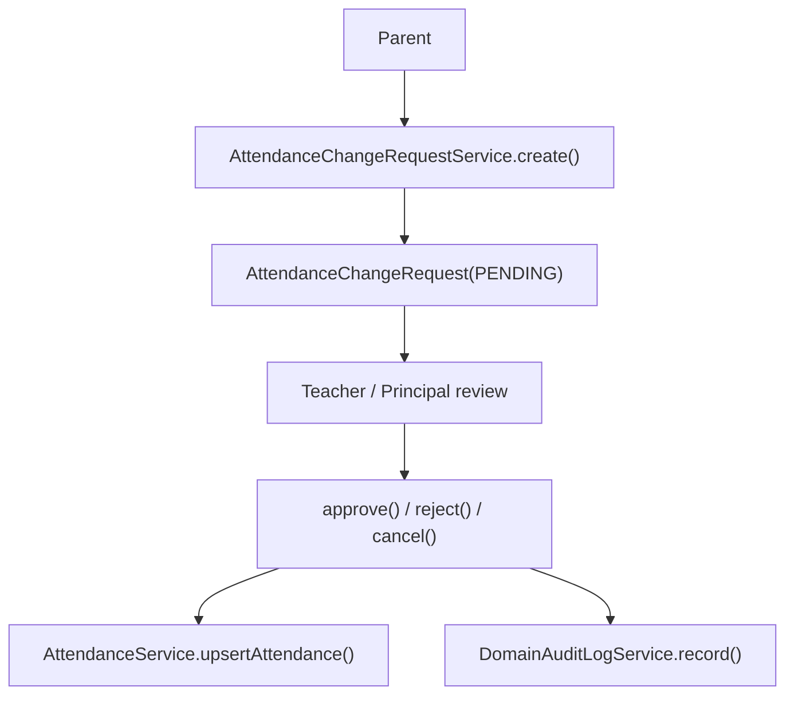
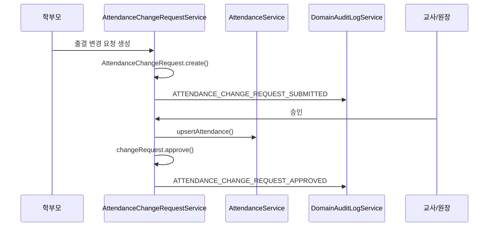

# [Spring Boot 포트폴리오] 23. 출결 변경 요청과 업무 감사 로그를 함께 설계하기

## 1. 이번 글에서 풀 문제

학부모가 출결을 수정할 수 있는 기능을 만든다고 가정해 봅시다.

가장 쉬운 구현은 이렇습니다.

- 학부모가 직접 `Attendance`를 수정

하지만 이 방식은 문제가 많습니다.

- 승인 흔적이 남지 않는다
- 누가 바꿨는지 추적하기 어렵다
- 교사/원장 검토 흐름이 없다
- 잘못 바꾸면 원본 상태가 바로 오염된다

KinderP는 이 문제를
`Attendance`와 `AttendanceChangeRequest`를 분리해서 풀었습니다.
그리고 중요한 상태 변화는 `domain_audit_log`에 남기도록 설계했습니다.

## 2. 먼저 알아둘 개념

### 2-1. “최종 상태”와 “승인 전 요청”은 다른 aggregate다

- `Attendance`
  - 최종 확정된 출결 데이터
- `AttendanceChangeRequest`
  - 아직 검토 중인 요청 데이터

이 둘을 분리하면 승인 흐름을 안전하게 만들 수 있습니다.

### 2-2. 업무 감사 로그는 인증 감사 로그와 목적이 다르다

- 인증 감사 로그
  - 로그인, refresh, 소셜 연결
- 업무 감사 로그
  - 입학 승인, 출결 요청 승인, 공지 수정/삭제

즉 “누가 무엇을 했는가”라는 질문은 같지만
보는 사람과 분석 목적이 다릅니다.

### 2-3. 감사 로그는 마지막에 덧붙이는 것이 아니라 상태 전이와 같이 가야 한다

상태 전이 직후 같은 트랜잭션에서 감사 로그를 남겨야
증적이 비지 않습니다.

### 2-4. 누가 무엇을 직접 바꿀 수 있는지 먼저 고정하자

이 글은 권한과 승인 흐름이 핵심이라, 역할별 허용 행동을 먼저 보는 편이 이해가 쉽습니다.

| 역할 | 직접 할 수 있는 일 | 직접 못 하는 일 |
|---|---|---|
| 학부모 | 출결 변경 요청 생성, 본인 요청 취소 | 최종 `Attendance` 직접 수정 |
| 교사/원장 | 요청 승인/거절, 최종 출결 반영 | 학부모 대신 임의 요청자로 가장하기 |
| 시스템 | 스케줄러 등 시스템성 사건 기록 | 사용자 승인 행위 대체 |

## 3. 이번 글에서 다룰 파일

```text
- src/main/java/com/erp/domain/attendance/entity/AttendanceChangeRequest.java
- src/main/java/com/erp/domain/attendance/service/AttendanceChangeRequestService.java
- src/main/java/com/erp/domain/attendance/controller/AttendanceChangeRequestController.java
- src/main/java/com/erp/domain/attendance/controller/AttendanceChangeRequestViewController.java
- src/main/resources/templates/attendance/requests.html
- src/main/java/com/erp/domain/domainaudit/entity/DomainAuditLog.java
- src/main/java/com/erp/domain/domainaudit/service/DomainAuditLogService.java
- src/main/java/com/erp/domain/domainaudit/service/DomainAuditLogQueryService.java
- src/main/java/com/erp/domain/domainaudit/controller/DomainAuditLogController.java
- src/main/java/com/erp/domain/domainaudit/controller/DomainAuditLogViewController.java
- src/main/resources/templates/domainaudit/audit-logs.html
- src/test/java/com/erp/api/AttendanceChangeRequestApiIntegrationTest.java
- src/test/java/com/erp/api/DomainAuditApiIntegrationTest.java
- docs/COMPLETED.md#archive-003
```

## 4. 설계 구상



핵심 기준은 아래였습니다.

1. 학부모는 최종 출결을 직접 수정하지 못한다
2. 먼저 요청 aggregate를 만든다
3. 승인 시점에만 최종 `Attendance`를 갱신한다
4. 상태 변화는 `domain_audit_log`에 함께 남긴다

## 5. 코드 설명

### 5-1. `AttendanceChangeRequest`: 요청 자체가 상태를 가진다

[AttendanceChangeRequest.java](../src/main/java/com/erp/domain/attendance/entity/AttendanceChangeRequest.java)의 핵심 메서드는 아래입니다.

- `create(...)`
- `approve(...)`
- `reject(...)`
- `cancel()`
- `isPending()`

즉 이 엔티티는 단순 DTO 저장소가 아니라
`PENDING -> APPROVED / REJECTED / CANCELLED` 상태 전이를 직접 갖습니다.

특히 `ensurePending()`으로
이미 처리된 요청을 다시 처리하지 못하게 막습니다.

### 5-2. `AttendanceChangeRequestService.create(...)`: 학부모 요청 생성

[AttendanceChangeRequestService.java](../src/main/java/com/erp/domain/attendance/service/AttendanceChangeRequestService.java)의
`create(...)`는 아래 순서로 동작합니다.

1. requester 조회
2. 학부모 역할인지 확인
3. 대상 원아 접근 권한 확인
4. 같은 날짜에 이미 pending 요청이 있는지 확인
5. `AttendanceChangeRequest.create(...)`
6. 저장 시 DB 제약으로 한 번 더 중복 pending 요청을 방지
7. 교사/원장에게 알림
8. `domainAuditLogService.record(...)`

여기서 중요한 점은
요청 생성과 감사 로그 기록이 같은 흐름으로 묶여 있다는 점입니다.

또 하나 중요한 점은
중복 요청 방지를 서비스의 `exists(...)` 검사에만 맡기지 않았다는 것입니다.
현재 저장소는 `attendance_change_request`에
`PENDING` 상태일 때만 값을 갖는 generated column + unique 제약을 두고,
저장 시 `DataIntegrityViolationException`이 나면
비즈니스 예외(`AT005`)로 번역합니다.

즉 “미리 한 번 확인하고, DB에서 마지막으로 한 번 더 막는” 이중 구조입니다.

### 5-3. `approve(...)`: 최종 `Attendance`는 승인 시점에만 반영

이 메서드는 이 기능의 핵심입니다.

`approve(...)`는 아래를 수행합니다.

1. `findByIdForUpdate(...)`로 요청 잠금
2. reviewer 권한 검증
3. 요청 데이터를 `AttendanceRequest`로 변환
4. `attendanceService.upsertAttendance(...)` 호출
5. 생성/수정된 attendance ID 조회
6. `changeRequest.approve(...)`
7. 학부모 알림
8. 업무 감사 로그 기록

즉 승인 전까지는 확정 출결이 변하지 않습니다.

### 5-4. `reject(...)`, `cancel(...)`

`reject(...)`와 `cancel(...)`도 같은 철학을 따릅니다.

- 단순 상태값 변경이 아니라
- 권한 검증
- 상태 전이
- 감사 로그 기록

을 같이 수행합니다.

즉 “요청 처리”는 언제나 증적과 함께 갑니다.

### 5-5. `DomainAuditLog`: 업무 상태 전이 기록 전용 엔티티

[DomainAuditLog.java](../src/main/java/com/erp/domain/domainaudit/entity/DomainAuditLog.java)는 아래 정보를 담습니다.

- `kindergartenId`
- `actorId`
- `actorName`
- `actorRole`
- `action`
- `targetType`
- `targetId`
- `summary`
- `metadataJson`

이 설계의 장점은 아래입니다.

- 사람이 읽는 요약(`summary`)
- 기계가 읽는 상세 정보(`metadataJson`)

를 동시에 가질 수 있다는 점입니다.

### 5-6. `DomainAuditLogService`: 기록은 여기서 통일

[DomainAuditLogService.java](../src/main/java/com/erp/domain/domainaudit/service/DomainAuditLogService.java)의 핵심 메서드는 아래입니다.

- `record(...)`
- `recordSystem(...)`

`record(...)`는 사용자 행위를 기록하고,
`recordSystem(...)`는 스케줄러 같은 시스템 행위를 기록할 때 씁니다.

예를 들어 입학 제안 만료처럼
사람이 직접 누르지 않은 사건도 감사 로그에 남길 수 있습니다.

### 5-7. `DomainAuditLogQueryService`와 운영 화면

[DomainAuditLogQueryService.java](../src/main/java/com/erp/domain/domainaudit/service/DomainAuditLogQueryService.java)의 핵심 메서드는 아래입니다.

- `getAuditLogsForPrincipal(...)`
- `exportAuditLogsCsvForPrincipal(...)`

[DomainAuditLogController.java](../src/main/java/com/erp/domain/domainaudit/controller/DomainAuditLogController.java)는

- `/api/v1/domain-audit-logs`
- `/api/v1/domain-audit-logs/export`

를 제공하고,

[DomainAuditLogViewController.java](../src/main/java/com/erp/domain/domainaudit/controller/DomainAuditLogViewController.java)와
[audit-logs.html](../src/main/resources/templates/domainaudit/audit-logs.html)은
원장용 운영 콘솔을 제공합니다.

즉 업무 감사 로그도 저장에서 끝나지 않고
조회와 export까지 닫힙니다.

여기서 조회 범위는 명확합니다.

| 주체 | domain audit 조회/API/CSV export |
|---|---|
| 원장 | 가능 |
| 교사 | 불가 |
| 학부모 | 불가 |

## 6. 실제 흐름



## 7. 테스트로 검증하기

대표 테스트는 아래입니다.

- [AttendanceChangeRequestApiIntegrationTest.java](../src/test/java/com/erp/api/AttendanceChangeRequestApiIntegrationTest.java)
  - 학부모 요청 생성
  - 교사/원장 승인/거절
  - 권한 실패
- [DomainAuditApiIntegrationTest.java](../src/test/java/com/erp/api/DomainAuditApiIntegrationTest.java)
  - principal 범위 조회
  - CSV export

즉 이 기능은 화면이 아니라
상태 전이와 감사 기록을 통합 테스트로 고정합니다.

## 8. 회고

이 기능의 핵심은 출결 수정 화면이 아닙니다.
핵심은 아래 분리입니다.

- 요청 aggregate와 확정 aggregate 분리
- 사용자 행위와 시스템 기록 분리
- 업무 감사와 인증 감사 분리

이 분리가 되어야 나중에

- 승인 정책 변경
- 알림 추가
- 관리자 조회 추가

가 훨씬 쉬워집니다.

### 현재 구현의 한계

현재 구조는 **단일 승인 흐름**에 집중합니다.
즉 다단계 결재나 교사 승인 후 원장 재승인 같은 복합 승인 체계는 아직 없습니다.
또 중복 요청 방지는 현재 `kid_id + date + PENDING` 유니크 가드에 집중돼 있으므로,
더 복잡한 중복 정의가 필요해지면 별도 정책이나 멱등 키 전략이 추가로 필요합니다.
하지만 요청 aggregate와 감사 로그를 이미 분리해 두었기 때문에, 나중에 승인 단계 수를 늘리기는 더 쉬운 상태입니다.

## 9. 취업 포인트

- “학부모가 최종 `Attendance`를 직접 바꾸지 못하게 하고, 승인 전 요청 aggregate를 별도로 뒀습니다.”
- “출결 요청 승인/거절/취소를 모두 상태 전이와 감사 로그로 남겨 운영 책임 추적이 가능하게 했습니다.”
- “업무 감사 로그를 인증 감사 로그와 분리해 보안 사건과 비즈니스 사건의 조회 목적을 분명히 나눴습니다.”

### 9-1. 1문장 답변

- “학부모가 최종 출결을 직접 수정하지 못하게 하고, 승인 전 요청 aggregate와 업무 감사 로그를 분리해 승인 흔적과 책임 추적을 남겼습니다.”

### 9-2. 30초 답변

- “이 기능의 핵심은 출결 수정 화면이 아니라 승인 전 요청 aggregate를 따로 두는 것입니다. 학부모는 `AttendanceChangeRequest`만 만들 수 있고, 교사나 원장이 승인할 때만 `AttendanceService.upsertAttendance(...)`를 통해 최종 출결이 바뀝니다. 그리고 요청 생성, 승인, 거절, 취소를 모두 `domain_audit_log`에 기록해 누가 무엇을 바꿨는지 운영 증적까지 함께 남깁니다.”

### 9-3. 예상 꼬리 질문

- “왜 학부모가 `Attendance`를 직접 수정하면 안 되나요?”
- “왜 요청 aggregate와 확정 aggregate를 분리했나요?”
- “auth audit와 domain audit를 분리한 이유는 무엇인가요?”

## 10. 시작 상태

- `08`, `22` 글까지 따라와서 출석 aggregate와 주요 상태 전이 워크플로우가 이미 있어야 합니다.
- 이 글의 목표는 **학부모 요청과 최종 출석 데이터를 분리하고, 그 사이의 승인 흔적을 업무 감사 로그로 남기는 것**입니다.
- 여기서 중요한 것은 “출결 수정 기능 추가”가 아니라, 승인 전 요청 aggregate를 따로 두는 설계입니다.

## 11. 이번 글에서 바뀌는 파일

```text
- 요청 aggregate:
  - src/main/java/com/erp/domain/attendance/entity/AttendanceChangeRequest.java
  - src/main/java/com/erp/domain/attendance/entity/AttendanceChangeRequestStatus.java
  - src/main/java/com/erp/domain/attendance/service/AttendanceChangeRequestService.java
  - src/main/java/com/erp/domain/attendance/controller/AttendanceChangeRequestController.java
  - src/main/java/com/erp/domain/attendance/controller/AttendanceChangeRequestViewController.java
- 업무 감사:
  - src/main/java/com/erp/domain/domainaudit/service/DomainAuditLogService.java
  - src/main/java/com/erp/domain/domainaudit/service/DomainAuditLogQueryService.java
  - src/main/java/com/erp/domain/domainaudit/controller/DomainAuditLogController.java
  - src/main/java/com/erp/domain/domainaudit/controller/DomainAuditLogViewController.java
  - src/main/resources/templates/domainaudit/audit-logs.html
- 스키마:
  - src/main/resources/db/migration/V13__add_admission_workflow_attendance_requests_and_domain_audit.sql
  - src/main/resources/db/migration/V14__guard_pending_attendance_change_requests.sql
- 검증:
  - src/test/java/com/erp/api/AttendanceChangeRequestApiIntegrationTest.java
  - src/test/java/com/erp/api/DomainAuditApiIntegrationTest.java
- 결정 로그:
  - docs/COMPLETED.md#archive-003
```

## 12. 구현 체크리스트

1. `AttendanceChangeRequest`를 승인 전 요청 aggregate로 분리합니다.
2. 학부모는 요청만 만들고, 교사/원장이 승인할 때만 실제 `Attendance`를 갱신하게 만듭니다.
3. 승인, 거절, 취소 상태 전이를 `AttendanceChangeRequest` 엔티티에 둡니다.
4. `V14` 유니크 가드로 같은 원생/날짜의 중복 `PENDING` 요청을 DB 레벨에서 차단합니다.
5. `DomainAuditLogService`로 사용자 행위와 시스템 행위를 공통 포맷으로 기록합니다.
6. 원장 전용 조회/API/CSV export를 domain audit 쪽에도 제공합니다.
7. 통합 테스트로 권한, 승인 흐름, 감사 로그 조회를 검증합니다.

## 13. 실행 / 검증 명령

```bash
./gradlew compileJava compileTestJava
# 현재 완성 저장소 기준 안정 검증
./gradlew --no-daemon integrationTest
```

성공하면 확인할 것:

- 산출물 체크리스트 기준으로 출결 요청 aggregate와 업무 감사 로그 산출물이 맞는다
- 통합 스위트 안에서 `AttendanceChangeRequestApiIntegrationTest`, `DomainAuditApiIntegrationTest`가 통과한다
- 학부모가 최종 출석을 직접 바꾸지 못하고 요청만 생성한다
- 승인/거절/취소가 모두 업무 감사 로그로 남는다

## 14. 산출물 체크리스트

- 새로 생긴 migration:
  - `V13__add_admission_workflow_attendance_requests_and_domain_audit.sql`
  - `V14__guard_pending_attendance_change_requests.sql`
- 새로 생긴 주요 클래스:
  - `AttendanceChangeRequest`
  - `AttendanceChangeRequestService`
  - `AttendanceChangeRequestController`
  - `DomainAuditLogService`
  - `DomainAuditLogController`
- 새로 생긴 화면:
  - `templates/attendance/requests.html`
  - `templates/domainaudit/audit-logs.html`
- 대표 검증 대상:
  - `AttendanceChangeRequestApiIntegrationTest`
  - `DomainAuditApiIntegrationTest`
- 같은 원생/날짜에 대해 동시에 두 개의 `PENDING` 요청이 생기지 않도록 DB 가드가 있다

## 15. 글 종료 체크포인트

- 요청 aggregate와 확정 aggregate를 왜 분리했는지 설명할 수 있다
- 출결 변경 요청이 권한과 상태 전이 중심 기능이라는 점을 설명할 수 있다
- 업무 감사 로그와 인증 감사 로그의 목적 차이를 설명할 수 있다
- 원장 운영 콘솔과 CSV export까지 포함해 운영 증적을 닫았다고 말할 수 있다

## 16. 자주 막히는 지점

- 증상: 학부모 요청 승인 없이 `Attendance`가 바로 바뀐다
  - 원인: 요청 aggregate를 거치지 않고 기존 출결 서비스에 직접 쓰기 경로를 열었을 수 있습니다
  - 확인할 것: `AttendanceChangeRequestService.create(...)`, `approve(...)`

- 증상: 감사 로그는 남는데 누가 무엇을 바꿨는지 설명이 약하다
  - 원인: action, targetType, metadata를 충분히 남기지 않았을 수 있습니다
  - 확인할 것: `DomainAuditLogService.record(...)`, `recordSystem(...)`
