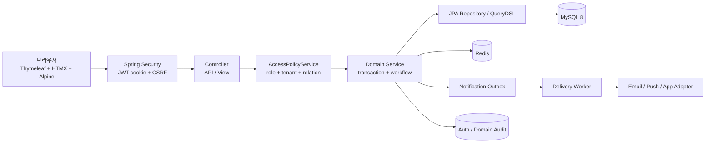

# 시스템 아키텍처와 요청 흐름

## 1. 전체 구조



현재 규모에서는 마이크로서비스로 나누지 않고 모듈러 모놀리스를 선택했습니다. 핵심 transaction과 tenant 권한을 한 프로세스 안에서 닫는 편이 더 단순하고 검증 가능하기 때문입니다.

## 2. 패키지 경계

```text
com.kinderp
├── domain/
│   ├── auth, member, kindergarten, classroom
│   ├── kid, attendance, kidapplication
│   ├── notepad, announcement, calendar
│   ├── notification, authaudit, domainaudit
│   └── dashboard
└── global/
    ├── config, common, exception
    └── security
```

각 domain은 `controller/service/repository/entity/dto`를 기준으로 나누고, 공통 보안·예외·시간·설정은 `global`에 둡니다. `LayerDependencyTest`는 계층 방향이 무너지는 것을 막습니다.

## 3. 로그인 요청 흐름

1. 브라우저가 `/login`에서 이메일과 비밀번호를 전송합니다.
2. Spring Security가 인증을 수행하고 `AuthRateLimitService`가 IP·이메일 기준 시도를 제한합니다.
3. 성공하면 access/refresh JWT를 HTTP-only cookie로 내려줍니다.
4. refresh token의 상태와 active session은 Redis TTL로 추적합니다.
5. `JwtFilter`가 이후 요청의 cookie를 검증하고 사용자 정보를 SecurityContext에 넣습니다.
6. `RoleRedirectInterceptor`가 역할·유치원 배정 상태에 맞는 초기 화면으로 이동시킵니다.
7. 로그인·refresh·social link/unlink 결과는 인증 감사 로그에 남습니다.

## 4. 쓰기 요청의 공통 흐름

```text
Controller 입력 검증
  → 인증 사용자 확인
  → service의 tenant/관계 권한 확인
  → 상태 전이·중복·멱등성 검증
  → 핵심 entity 저장
  → 업무 감사 로그 / Outbox 기록
  → ApiResponse 또는 View redirect
```

외부 네트워크 호출은 핵심 업무 transaction에 직접 묶지 않습니다. Outbox를 통해 재시도 가능한 경계로 분리합니다.

## 5. 왜 이 구조인가

### URL 권한만 사용하지 않은 이유

URL의 `hasRole`은 “원장인가”만 판단할 수 있고, “이 원장이 이 유치원의 이 원생을 수정하는가”까지 보장하지 못합니다. 그래서 `SecurityConfig`, `@PreAuthorize`, `AccessPolicyService`, repository tenant 조건을 겹쳐 사용합니다.

### 모놀리스를 유지한 이유

현재 핵심 문제는 서비스 간 네트워크 통신이 아니라 한 유치원 안의 상태 정합성과 권한입니다. 이 단계에서 서비스 분리를 하면 transaction·권한·운영 복잡도만 늘어납니다. 분리 후보는 추후 notification delivery와 audit/reporting처럼 비동기·읽기 중심 영역입니다.

### Redis를 사용한 이유

MySQL에 세션 revoke와 짧은 rate limit counter를 저장하면 인증 경로의 만료·조회 비용이 업무 데이터와 섞입니다. Redis TTL은 세션·rate limit·짧은 dashboard cache의 수명과 잘 맞습니다.

## 6. 구현 근거

- 보안: `src/main/java/com/erp/global/security/`
- 접근 정책: `src/main/java/com/erp/global/security/access/AccessPolicyService.java`
- JWT: `src/main/java/com/erp/global/security/jwt/`
- Outbox: `src/main/java/com/erp/domain/notification/`
- 시간: `src/main/java/com/erp/global/common/ProductTime.java`
- 계층 테스트: `src/test/java/com/erp/architecture/LayerDependencyTest.java`
