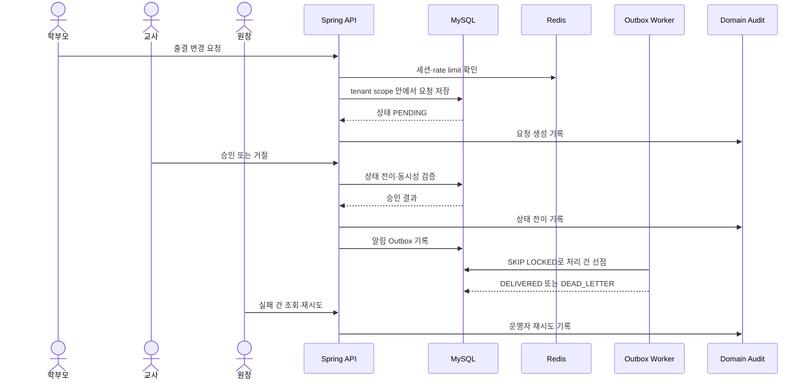

# KinderP 포트폴리오 설계 서사

## 한 문장

KinderP는 원장·교사·학부모가 하나의 유치원 데이터를 서로 다른 권한으로 처리할 때 발생하는 데이터 누출, 중복 승인, 출결 정정 충돌, 알림 전달 실패를 정합성과 운영 가시성으로 통제하는 다중 테넌트 내부 운영 플랫폼이다.

## TownPet과의 차이

| 프로젝트 | 대표 문제 | 증명할 역량 |
| --- | --- | --- |
| TownPet | 레거시 데이터를 새 서비스 구조로 옮기면서 모듈 경계와 성능·복구를 확보 | 마이그레이션, 모듈러 모놀리스, PostgreSQL/Flyway, 재현 가능한 릴리스 |
| KinderP | 여러 역할이 같은 tenant 데이터를 동시에 처리할 때 권한과 상태 정합성을 유지 | 접근 제어, workflow, 동시성·멱등성, 감사·Outbox, 운영자 경험 |

두 프로젝트 모두 모놀리식 구조를 사용하지만 문제의 축이 다르다. TownPet은 시스템을 바꾸는 과정의 안전성을, KinderP는 운영 중 발생하는 업무 상태와 실패의 통제 가능성을 보여준다.

핵심 상태 전이 표와 구현·테스트 위치는 [workflow 상태 전이 문서](./workflow-state-machine.md)에 따로 고정한다.

## 대표 시나리오

## 설계 결정

### 하나의 모놀리스, 분리된 책임

현재 규모에서 트랜잭션과 tenant 권한을 한 애플리케이션 안에서 닫고, `domain/*`의 경계를 테스트로 강제한다. 서비스가 커져도 먼저 분리할 후보는 알림 전달과 감사 조회이지, 핵심 승인 transaction 전체가 아니다.

### 권한은 URL 규칙만으로 끝내지 않는다

Controller의 `@PreAuthorize`, service의 요청자 검증, repository의 tenant 조건, 통합 테스트의 교차 tenant 접근 실패를 함께 사용한다. 어느 한 계층을 우회해도 다른 유치원의 데이터가 반환되지 않는 것이 완료 조건이다.

### 외부 전달은 Outbox로 분리한다

업무 transaction과 외부 webhook·email·push 전달을 같은 transaction에 묶지 않는다. Outbox 상태를 `PENDING → PROCESSING → DELIVERED/DEAD_LETTER`로 관리하고, worker 경합은 DB row claim으로 제어한다. 운영자는 실패 원인과 재시도 이력을 확인할 수 있어야 한다.

### 측정 없는 확장은 하지 않는다

대시보드 집계와 출결/Outbox 처리를 대표 성능 시나리오로 삼고, 데이터 규모·동시 사용자·쿼리 수·p95·실행계획을 같은 조건에서 전후 비교한다. Kafka, Kubernetes, 별도 서비스 도입은 병목과 운영 비용이 측정된 뒤에만 검토한다.

## 면접에서 보여줄 순서

1. 학부모의 요청이 tenant 내부에 저장된다.
2. 교사 또는 원장의 승인 권한과 허용 상태 전이를 확인한다.
3. 상태 전이와 알림 생성이 감사 로그·Outbox로 이어지는 것을 보여준다.
4. 동시 요청에서 한 번만 승인되는 테스트를 보여준다.
5. Outbox dead-letter 운영 화면에서 실패 원인과 재시도를 보여준다.
6. 같은 시나리오의 성능 전후 수치와 배포·복구 증거로 마무리한다.

## 현재 증거와 남은 보완

| 주장 | 현재 증거 | 외부 환경에서 남은 보완 |
| --- | --- | --- |
| tenant·role 경계 | `AccessPolicyService`, 교차 tenant API 통합 테스트, 접근 매트릭스 | 실제 운영 tenant 구성에서 권한 감사 로그와 접근 정책 점검 |
| 상태 전이 | 입학·출결 요청 서비스, 허용 상태 전이 테스트, 동시 요청·멱등성 검증 | 트래픽 증가 시 workflow 상태 이력 보관 정책 점검 |
| 전달 실패 대응 | Notification Outbox, `FOR UPDATE SKIP LOCKED`, worker 경쟁 테스트, dead-letter retry 운영 API | 실제 provider sandbox, webhook 수신·rate limit·reconciliation 검증 |
| 성능 개선 | Notepad/Dashboard query count·응답 시간·k6 p95·EXPLAIN 측정값 | 운영 DB 규모와 실제 HTTPS 경로에서 동일 시나리오 재측정 |
| 운영 가능성 | Docker·runbook·prod safety·backup checksum·disposable restore·readiness/HTTPS proxy 로컬 검증, netcup Compose·GHCR·암호화 backup 자산 | 실제 netcup DNS/TLS, 내부 MySQL/Redis 운영 volume, 외부 rollback 실행 |
